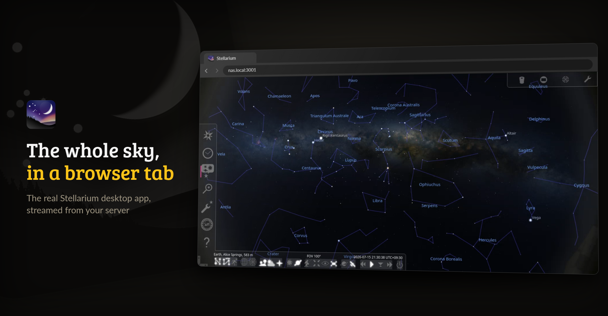
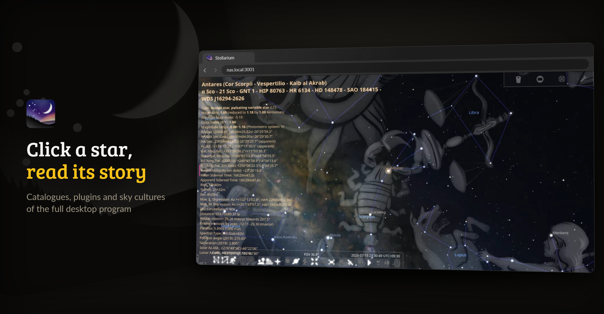

<p align="center">
  <picture>
    <source media="(prefers-color-scheme: dark)" srcset="https://raw.githubusercontent.com/junkerderprovinz/stellarium/main/.github/assets/stellarium-banner-dark.png">
    
  </picture>
</p>

<p align="center">
  <a href="https://github.com/junkerderprovinz/stellarium/actions/workflows/build.yml"></a>&nbsp;
  <a href="https://github.com/junkerderprovinz/stellarium/actions/workflows/lint.yml"></a>&nbsp;
  <a href="https://hub.docker.com/r/junkerderprovinz/stellarium"></a>&nbsp;
  <a href="https://hub.docker.com/r/junkerderprovinz/stellarium"></a>&nbsp;
  <a href="https://github.com/junkerderprovinz/stellarium/pkgs/container/stellarium"></a>&nbsp;
  <a href="https://github.com/Stellarium/stellarium"></a>&nbsp;
  <a href="https://unraid.net"></a>&nbsp;
  <a href="LICENSE"></a>
</p>

<p align="center">
<b>Stellarium, in your browser.</b> Explore the night sky from any device. No VNC client, no local install.<br>
This runs the full Stellarium desktop planetarium inside a single container and streams it to your
browser over <a href="https://github.com/selkies-project/selkies">Selkies</a> (H.264 video), so panning
the sky, zooming into a nebula and scrubbing through time stay smooth, the part of a real-time
planetarium where the old noVNC containers feel laggy.
</p>

<!-- download-buttons: written by scripts/gen_download_buttons.py -->
<p align="center">
  <a href="https://ca.unraid.net/apps/stellarium-1we6aez0jcmlhj"></a>
  &nbsp;
  <a href="https://hub.docker.com/r/junkerderprovinz/stellarium/"></a>
  &nbsp;
  <a href="https://github.com/junkerderprovinz/stellarium/releases/latest"></a>
</p>
<!-- /download-buttons -->

<br>

<p align="center">
A one-knight job: I build it, keep it running, work through the issues and add what people ask for, until nothing is missing. It is free, with no accounts, no telemetry, no ads and no paid tier. No asterisk anywhere. Nothing readable ever leaves your own walls. Forged on evenings and weekends, with heart and stubbornness.
</p>

<p align="center">
If it has earned a place on your server or computer, toss a coin to your knight: it helps cover the costs and keeps the project alive. It also makes this knight's heart beat a little faster. Three ways below, whichever suits you.
</p>

<!-- give-buttons: written by scripts/gen_download_buttons.py -->
<p align="center">
  <a href="https://buymeacoffee.com/junkerderprovinz"></a>
  &nbsp;
  <a href="https://www.paypal.com/donate/?hosted_button_id=76FVV52TKXTUS"></a>
  &nbsp;
  <a href="https://junkerderprovinz.github.io/junkerderprovinz/"></a>
</p>
<!-- /give-buttons -->

<br>

## Table of Contents

1. [What it looks like](#1-what-it-looks-like)
2. [What it does](#2-what-it-does)
3. [Getting started](#3-getting-started)
4. [How AI is used here](#4-how-ai-is-used-here)
5. [Support this project](#5-support-this-project)

<br>

## 1. What it looks like

The pictures come from a test instance set to Alice Springs on a July night.

<p align="center">
  
  <br><em>The full desktop Stellarium in a browser tab, streamed from the container</em>
</p>

<p align="center">
  
  <br><em>Click any object for its data, here Antares with the constellation art switched on</em>
</p>

<br>

## 2. What it does

- **The real program.** The only other way to have Stellarium in a browser is Stellarium Web, a separate and much lighter rewrite. This is the full desktop app with its plugins, catalogues and sky cultures, installed from Debian trixie's `stellarium` package for amd64 and arm64.
- **A smooth sky.** Selkies streams the desktop as H.264 video, so dragging across the sky and speeding up time stay fluid where a noVNC desktop stutters.
- **GPU optional.** A GPU passed into the container is used; without one, Stellarium renders in software and still works.
- **Sized to your window.** The desktop follows your browser window, so there is no screen size to set and memory grows only with the window you use.
- **Nothing lost on updates.** Your location, downloaded catalogues, landscapes, plugins and screenshots live under `/config`.

<br>

## 3. Getting started

On Unraid, install **Stellarium** from [Community Applications](https://ca.unraid.net/apps/stellarium-1we6aez0jcmlhj). Anywhere else, one container is enough:

```sh
docker run -d --name stellarium -p 3001:3001 --shm-size=1gb \
  -v /path/to/config:/config \
  junkerderprovinz/stellarium:latest
```

Then open `https://<server>:3001` and accept the self-signed certificate once. Stellarium starts maximised; press `F6` to set your location, and `F2` opens the configuration window with the plugins.

> [!NOTE]
> The WebUI has no login by default, for use on a trusted LAN. Set `CUSTOM_USER` and `PASSWORD` to turn on the built-in login, and never expose the WebUI to the internet without a VPN or an authenticating reverse proxy in front.

<br>

## 4. How AI is used here

One knight builds this, and AI is one of the tools I work with, the same way I work with an editor or a compiler. It helps me write code and documentation and it checks my work, and that saves me a good many evenings. It does not make the decisions, though. I read and understand everything before it ships, and if something here breaks, that is on me and not on the tool.

You do not have to take my word for it. The code is open and every release note is written by hand. The issue tracker shows how problems actually get handled, including the ones I got wrong the first time. If you find something that is not right, open an issue and I will look at it.

<br>

## 5. Support this project

Questions, bugs, ideas or feature requests? Please [open a GitHub issue](https://github.com/junkerderprovinz/stellarium/issues).

A one-knight job: I build it, keep it running, work through the issues and add what people ask for, until nothing is missing. It is free, with no accounts, no telemetry, no ads and no paid tier. No asterisk anywhere. Nothing readable ever leaves your own walls. Forged on evenings and weekends, with heart and stubbornness.

If it has earned a place on your server or computer, toss a coin to your knight: it helps cover the costs and keeps the project alive. It also makes this knight's heart beat a little faster. Three ways below, whichever suits you.

<!-- give-buttons: written by scripts/gen_download_buttons.py -->
<p align="center">
  <a href="https://buymeacoffee.com/junkerderprovinz"></a>
  &nbsp;
  <a href="https://www.paypal.com/donate/?hosted_button_id=76FVV52TKXTUS"></a>
  &nbsp;
  <a href="https://junkerderprovinz.github.io/junkerderprovinz/"></a>
</p>
<!-- /give-buttons -->

<br>

<sub>[Stellarium](https://github.com/Stellarium/stellarium) is GPL-2.0 software by the Stellarium developers, and this project is not affiliated with or endorsed by it. The packaging here is AGPL-3.0; see [LICENSE](LICENSE) and [NOTICE](NOTICE) for the bundled software.</sub>
